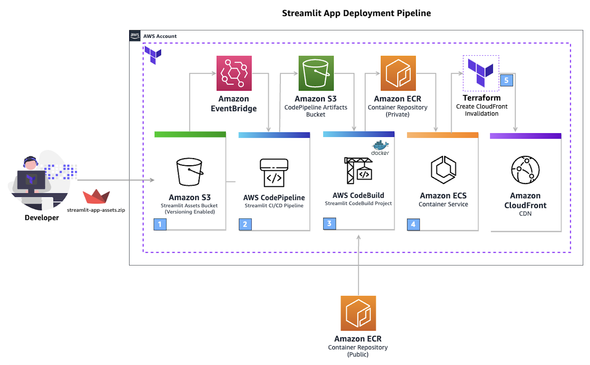

# EquityLens

**AI-powered news analysis for smarter equity research**

EquityLens is an end-to-end LLM-powered news research tool that helps equity research analysts efficiently analyze financial news by retrieving, summarizing, and highlighting key market insights. Built with LangChain and OpenAI API, it demonstrates how large language models can streamline research workflows and transform unstructured news into actionable intelligence.

**Deployed on AWS serverless infrastructure with enterprise-grade scalability and reliability.**

## Features

- **Multi-Article Analysis**: Process up to 3 financial news articles simultaneously
- **Intelligent Q&A**: Ask questions about processed articles using natural language
- **Key Quote Extraction**: Automatically identifies and displays impactful quotes from articles
- **Trend Indicators**: Visual sentiment indicators (Positive, Negative, Neutral)
- **Source Attribution**: Direct links to original articles with contextual quotes
- **Vector Search**: FAISS-powered semantic search for accurate information retrieval
- **Auto-scaling**: Serverless architecture that scales with demand
- **Global CDN**: Fast worldwide access via CloudFront distribution

## Live Demo

**[View Live Application on AWS →](https://dfn8hh50ps75m.cloudfront.net)**

*Hosted on AWS ECS Fargate with global CloudFront distribution*

## Architecture

### Cloud Infrastructure
- **AWS ECS Fargate**: Serverless container orchestration across multiple availability zones
- **Application Load Balancer**: High availability with automatic failover
- **CloudFront CDN**: Global content delivery with edge caching
- **Auto-scaling**: Dynamic container scaling based on demand
- **Infrastructure as Code**: Complete infrastructure managed via Terraform

### CI/CD Pipeline
- **AWS CodePipeline**: Automated deployment pipeline
- **AWS CodeBuild**: Docker image building and testing
- **Amazon ECR**: Container registry for Docker images
- **Terraform**: Infrastructure provisioning and updates
- **Zero-downtime deployments**: Rolling updates with health checks

## Tech Stack

### Application Layer
- **Frontend**: Streamlit
- **LLM**: OpenAI GPT (configurable model)
- **Framework**: LangChain
- **Vector Store**: FAISS
- **Embeddings**: OpenAI text-embedding-3-small
- **Article Processing**: newspaper3k

### Infrastructure Layer
- **Container Platform**: AWS ECS with Fargate
- **Load Balancing**: Application Load Balancer
- **CDN**: Amazon CloudFront
- **Container Registry**: Amazon ECR
- **Infrastructure**: Terraform modules
- **CI/CD**: AWS CodePipeline + CodeBuild

## Usage

1. **Add Article URLs**: Enter up to 3 financial news article URLs in the sidebar
2. **Process Articles**: Click "Process" to analyze and index the articles
3. **Ask Questions**: Use natural language to query the processed content
4. **Review Results**: Get answers with trend indicators, key quotes, and source links

### Example Queries
- "What are the main factors affecting stock performance?"
- "What do analysts predict for Q4 earnings?"
- "What risks are mentioned in these articles?"

## Technical Implementation

### Application Architecture
- **RAG Framework**: Retrieval-Augmented Generation for accurate, source-backed answers
- **Document Processing**: Recursive text splitting with optimal chunk sizes (500 chars, 50 overlap)
- **Vector Store**: FAISS indexing with OpenAI embeddings for semantic search
- **LLM Integration**: Configurable OpenAI models with RetrievalQAWithSourcesChain

### Cloud Architecture Benefits
- **High Availability**: Multi-AZ deployment with automatic failover
- **Scalability**: Auto-scaling containers based on traffic patterns
- **Performance**: Global CDN ensures low latency worldwide
- **Cost Optimization**: Pay-per-use serverless model
- **Security**: VPC isolation with security groups and SSL termination

### Key Components
- **Multi-document Analysis**: Processes and synthesizes insights from multiple articles
- **Source Attribution**: Maintains traceability from answers back to original sources
- **Real-time Processing**: Dynamic quote extraction and sentiment analysis
- **Error Handling**: Robust handling for failed URL fetches and API calls
- **Containerization**: Docker-based deployment for consistency and portability